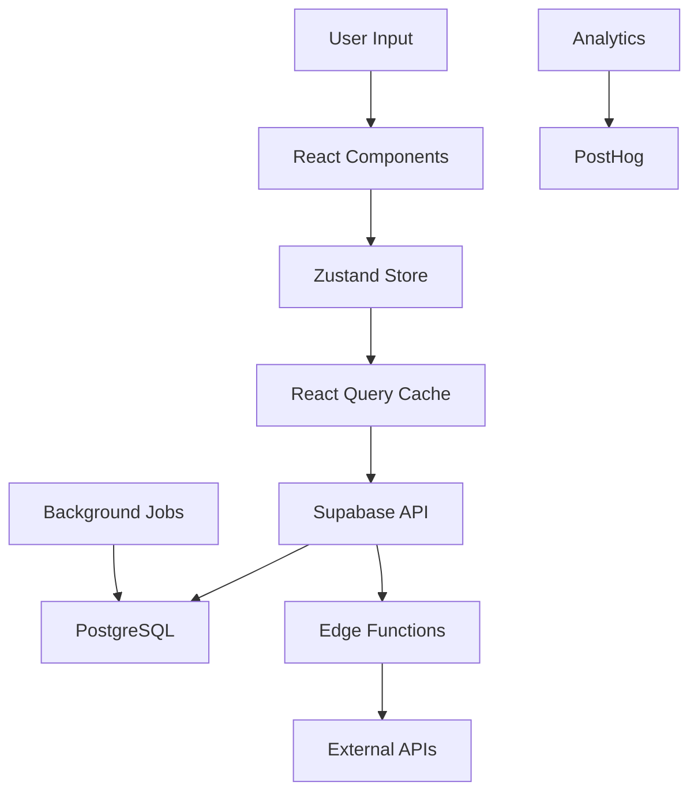

# 🦾 Halterofit - Intelligent Bodybuilding Platform
*Plan de Développement MVP-First Strategy*

> **MVP-First Approach** : Ce document présente notre stratégie de développement en phases, en commençant par un MVP solide pour valider le marché, puis en évoluant vers la plateforme complète.

---

## 📋 Table des Matières
1. [Vision et Objectifs Long Terme](#-vision-et-objectifs-long-terme)
2. [MVP Strategy & Focus](#-mvp-strategy--focus)
3. [Public Cible](#-public-cible)
4. [Analyse Concurrentielle](#-analyse-concurrentielle)
5. [Features MVP (Phase 1)](#️-features-mvp-phase-1)
6. [Features Avancées (Phase 2-3)](#-features-avancées-phase-2-3)
7. [Architecture & Implementation](#️-architecture--implementation)
8. [Roadmap Exécution](#️-roadmap-exécution)
9. [Stratégie de Monétisation](#-stratégie-de-monétisation)
10. [Métriques de Succès](#-métriques-de-succès)
11. [Documentation Technique](#-documentation-technique)

---

## 🎯 Vision et Objectifs Long Terme

### Mission Statement
**"Révolutionner l'entraînement en musculation grâce à l'intelligence artificielle et l'analyse de données avancée, pour maximiser les gains de chaque athlète."**

### Problèmes Résolus (Vision Complète)
- **Stagnation**: 80% des pratiquants abandonnent après 6 mois à cause des plateaux
- **Overtraining**: Manque de signaux objectifs pour détecter la surcharge
- **Personnalisation**: Programs one-size-fits-all qui ignorent l'individualité
- **Cycle Management**: Aucun outil pour enhanced athletes (marché tabou mais réel)
- **Data Fragmentation**: Données éparpillées (nutrition, training, récupération)

### Vision à Long Terme
Devenir la référence mondiale pour l'optimisation de performance en bodybuilding, combinant science du sport moderne et besoins réels des athlètes sérieux.

### Différenciateurs Clés (Avantage Concurrentiel)
1. **Intelligence Prédictive**: Anticipe plateaux et overtraining avant qu'ils surviennent
2. **Enhanced-Friendly**: Seule app à reconnaître et optimiser pour enhanced athletes
3. **RPE Analytics**: Système d'effort perçu le plus avancé du marché
4. **Science-Based**: Chaque fonctionnalité basée sur recherche peer-reviewed
5. **Privacy First**: Données sensibles (cycles) protégées et chiffrées

---

## 🚀 MVP Strategy & Focus

### Philosophy MVP-First
Notre approche phased permet de **valider le marché rapidement** tout en construisant les fondations pour les features avancées futures.

### MVP Core Value Proposition
**"Le seul fitness tracker qui comprend vraiment les bodybuilders sérieux"**

#### Pourquoi MVP d'abord ?
1. **Validation rapide** : Tester l'adéquation produit-marché en 3 mois
2. **Learning acceleré** : Feedback réel d'utilisateurs pour orienter Phase 2
3. **Ressources limitées** : Focus sur l'exécution plutôt que sur la sur-ingénierie
4. **Competitive advantage** : Time-to-market rapide avant que la concurrence réagisse

#### MVP Success Criteria
- **100 beta users** actifs après 3 mois
- **50% D7 retention** (industry benchmark: 25%)
- **NPS > 40** (satisfaction utilisateur)
- **3.5 workouts/semaine** par utilisateur actif

### MVP Scope Discipline
**✅ In Scope (MVP)**
- Smart workout logging avec RPE
- Exercise library (500+ exercices)
- Basic analytics avec trends
- Rest timer intelligent
- Plateau detection basique
- Energy readiness score

**❌ Out of Scope (Phase 2)**
- Voice commands
- Social features
- Enhanced athlete tracking
- AI recommendations avancées
- Body composition analysis

**🔮 Future Vision (Phase 3)**
- Full AI coaching platform
- Enhanced athlete ecosystem
- Coaching marketplace
- Advanced biometric integration

---

## 👥 Public Cible

### MVP Target: Focus Personas Prioritaires

#### **Primary MVP Target: "Alex - Serious Natural Lifter"** ⭐
- **Âge**: 20-35 ans
- **Expérience**: 2-5 années d'entraînement sérieux
- **Statut**: Natural, orienté data
- **Objectifs MVP**: Briser plateaux, voir progression claire, éviter overtraining
- **Pain Points MVP**:
  - Apps actuelles trop simplistes ou trop complexes
  - Manque de progression mesurable
  - Pas de détection de plateaux
  - Programs génériques inefficaces
- **Budget**: 0-30$/mois (freemium → premium)
- **MVP Value**: "Enfin une app qui comprend la musculation sérieuse"

#### **Secondary MVP Target: "Sarah - Natural Competitor"**
- **Âge**: 22-30 ans
- **Expérience**: Compétitrice bikini/physique
- **Statut**: Natural + drug tested
- **Objectifs MVP**: Periodization intelligente, balance récupération/volume
- **Pain Points MVP**:
  - Periodization complexe mal supportée
  - Manque d'outils pour detecter fatigue
  - Analytics insuffisantes pour prep
- **Budget**: 20-50$/mois
- **MVP Value**: "Analytics qui comprennent la preparation competition"

#### **Future Target: "Marcus - Enhanced Bodybuilder"** (Phase 2)
- **Âge**: 25-35 ans
- **Expérience**: 5+ années d'entraînement sérieux
- **Statut**: Enhanced (TRT/cycles)
- **Objectifs Long Terme**: Optimiser cycles, maximiser gains, éviter sides
- **Pain Points Future**:
  - Aucun outil pour enhanced athletes
  - Tracking cycles impossible ailleurs
  - Optimisation performance/santé complexe
- **Budget**: 50-100$/mois pour outils/suppléments
- **Future Value**: "La seule app enhanced-friendly au monde"

### MVP Market Segments Strategy
- **MVP Focus (80%)**: Serious natural lifters + competitors
- **Phase 2 Expansion (60%)**: Enhanced bodybuilders (différenciateur clé)
- **Phase 3 (10%)**: Powerlifters/strongmen, general fitness evolution

### MVP User Acquisition Strategy
1. **Reddit Communities**: r/naturalbodybuilding, r/powerlifting
2. **YouTube Partnerships**: Evidence-based fitness channels
3. **Instagram**: Natural bodybuilding influencers
4. **Word of mouth**: Product-market fit dans niche passionnée

---

## 🔍 Analyse Concurrentielle

### Concurrents Directs

#### JeFit
**Forces**: Base d'exercices massive, interface propre
**Faiblesses**: Analytics basiques, pas d'IA, généraliste
**Part de marché**: ~2M utilisateurs
**Pricing**: Freemium 6.99$/mois

#### Strong (iOS)
**Forces**: UX excellente, sync rapide
**Faiblesses**: iOS only, pas d'analytics avancés
**Part de marché**: ~500K utilisateurs
**Pricing**: One-time 4.99$

#### Hevy
**Forces**: Interface moderne, analytics correctes
**Faiblesses**: Pas d'IA prédictive, programs limités
**Part de marché**: ~1M utilisateurs
**Pricing**: Freemium 8.99$/mois

### Concurrents Indirects
- **MyFitnessPal**: Nutrition (pas training)
- **Whoop**: Recovery (pas strength)
- **TrainerRoad**: Cyclisme (excellentes analytics)

### Opportunités de Différenciation
1. **Niche Focus**: Bodybuilding vs fitness général
2. **Enhanced Market**: Marché non-adressé de 10M+ athlètes
3. **Predictive AI**: Technologie supérieure aux concurrents
4. **Scientific Rigor**: Recherche vs marketing fluff

---

## ⚙️ Features MVP (Phase 1)

> **MVP Timeline** : 12 semaines (voir [MVP_ROADMAP.md](docs/MVP_ROADMAP.md) pour détails sprint par sprint)

### 1. Smart Workout Logger 🏋️ *(MVP Core)*

#### Interface de Logging MVP
- **Quick Entry**: Tap pour log sets, interface optimisée gym
- **Auto-Timer**: Rest periods adaptatifs selon exercice et RPE
- **Offline-First**: Fonctionne sans connexion (essentiel gym)
- **Exercise Library**: 500+ exercices avec instructions (Phase 1)
- **Gesture Controls**: Swipe pour ajuster poids, tap pour increment

#### RPE Tracking System ⭐ *(Différenciateur MVP)*
- **Scale 1-10**: Plus intuitive pour MVP que 1-100
- **Visual Feedback**: Interface claire avec couleurs RPE
- **Quick Selection**: Tap rapide pour RPE après chaque set
- **Historical Context**: "RPE plus élevé que d'habitude pour ce poids"
- **Pattern Alerts**: "RPE élevé 3 sets de suite, considérer repos"

#### Session Analytics MVP
- **Volume Tracking**: Sets × reps × poids par muscle group
- **Basic Intensity**: RPE moyen, max par exercice
- **Time Tracking**: Durée totale, temps par exercice
- **Session Notes**: Notes rapides post-workout
- **PR Detection**: Highlight automatique des records personnels

### 2. Performance Analytics 📊 *(MVP Intelligence)*

#### Basic Trend Analysis
- **Strength Progression**: Graphiques simples par exercice
- **Volume Trends**: Progression weekly/monthly
- **RPE Patterns**: Trends de difficulté par période
- **Workout Frequency**: Consistency tracking
- **Export Data**: CSV pour analyse externe

#### Plateau Detection Engine 🚨 *(MVP Différenciateur)*
- **Auto-Detection**: Stagnation >3 semaines identifiée automatiquement
- **Confidence Score**: Probabilité statistique de plateau réel
- **Breaking Suggestions**: Protocols basés sur science (volume, technique, deload)
- **Progress Alerts**: "Aucun progrès sur Bench Press depuis 3 semaines"

### 3. Energy Readiness Score 🎯 *(MVP Innovation)*

#### Questionnaire Rapide (30 secondes)
- **Sleep Quality**: 1-10 avec durée optionnelle
- **Energy Level**: Comment tu te sens aujourd'hui
- **Motivation**: Mental readiness pour training
- **Muscle Soreness**: Niveau général de courbatures
- **Stress Level**: Impact vie personnelle/travail

#### Score & Recommendations
```typescript
interface ReadinessScore {
  overall: number; // 0-100
  recommendation: 'go_hard' | 'normal' | 'light' | 'rest';
  message: string; // "Excellente journée pour des PRs!"
  volumeAdjustment?: number; // +/- % suggestion
}
```

**Adaptive Suggestions MVP**:
- **Green (80-100)**: "Go hard, excellente journée pour PRs"
- **Yellow (60-79)**: "Session normale, maintenir qualité"
- **Orange (40-59)**: "Session légère, focus technique"
- **Red (<40)**: "Repos ou récupération active recommandé"

### 4. Exercise Library & Programs 📚 *(MVP Foundation)*

#### Exercise Database MVP
- **500+ Exercices**: Focus bodybuilding + powerlifting basics
- **Search & Filter**: Par muscle group, équipement, difficulté
- **Instructions**: Texte clair + tips de technique
- **Favoris**: Quick access aux exercices préférés
- **Recently Used**: Smart suggestions basées sur historique

#### Basic Program Templates
- **Push/Pull/Legs**: Version 3,4,5,6 jours
- **Upper/Lower**: 2x et 3x par semaine
- **Full Body**: Pour débutants
- **Custom Builder**: Création simple avec guidelines volume

### MVP Scope Summary

**✅ Phase 1 MVP (12 semaines)**
| Feature | Status | Value Proposition |
|---------|--------|-------------------|
| Workout Logging | Core | "Interface la plus rapide pour logger au gym" |
| RPE Tracking | Différenciateur | "Seule app qui comprend vraiment l'effort perçu" |
| Plateau Detection | Innovation | "Détection automatique des stagnations" |
| Readiness Score | Unique | "Optimise tes sessions selon ton état" |
| Exercise Library | Foundation | "500+ exercices avec instructions pro" |

---

## 🚀 Features Avancées (Phase 2-3)

> **Post-MVP Features** : Ces excellentes idées seront implémentées après validation MVP

### Phase 2: Intelligence & Social (Mois 4-6)

#### 1. Advanced Program Builder 🧠
- **Auto-Periodization**: Linear, block, daily undulating, conjugate
- **Template Library Étendue**: 20+ programs scientifiques
- **Volume Guidelines Intelligentes**:
```typescript
interface VolumeGuidelines {
  muscleGroup: string;
  weeklyVolume: {
    beginner: [number, number]; // Range sets/week
    intermediate: [number, number];
    advanced: [number, number];
  };
  frequency: { minimum: number; optimal: number; maximum: number; };
}
```

#### 2. Advanced Analytics & Voice Commands 🎤
- **Voice Logging**: "15 reps à 225 pounds"
- **RPE Heatmaps**: Patterns de fatigue visuels
- **Advanced Visualizations**: Strength curves, comparative analysis
- **Recovery Integration**: HRV, subjective wellness
- **Predictive Analytics**: Modèle SRA (Stimulus-Recovery-Adaptation)

#### 3. Social Features & Community 👥
- **Training Partners**: Shared workouts, motivation
- **Leaderboards**: Anonymous competitive elements
- **Progress Sharing**: Privacy-controlled achievements
- **Community Challenges**: Natty vs enhanced leagues

### Phase 3: Enhanced & AI Platform (Mois 7+)

#### 1. Enhanced Athlete Ecosystem 💊 *(Différenciateur Unique)*
**Discrete Cycle Tracking**:
- **Phase Tracking**: Natural, Cruise, Blast, PCT
- **Compound Logging**: Anonymized statistical database
- **Performance Correlation**: Dosage vs gains analysis
- **Health Monitoring**: Discrete biomarker tracking
- **Privacy & Security**: End-to-end encryption, legal compliance

#### 2. AI Coaching Platform 🤖
- **Plateau Breaking Engine**: Advanced algorithmic protocols
- **Personalized Programming**: AI-generated workouts
- **Recovery Optimization**: Multi-source integration (Whoop, Oura, etc.)
- **Performance Prediction**: 3-6-12 month projections

#### 3. Body Composition & Advanced Analytics 📸
- **Photo Progress Tracking**: AI-powered BF% estimation
- **Muscle Gain Visualization**: Change highlighting
- **Timeline Projections**: "Future you" predictions
- **Supplement Stack Optimizer**: Evidence-based recommendations

#### 4. Platform Ecosystem 🌐
- **Coaching Marketplace**: Expert-created programs
- **Research Contribution**: Anonymous data for science
- **API Access**: Third-party integrations
- **Enterprise Features**: Gym chain partnerships

#### Privacy & Security
- **End-to-End Encryption**: Données sensibles chiffrées
- **Anonymous Analytics**: Agrégation sans identification
- **Legal Compliance**: Recherche scientifique framework
- **User Control**: Delete data permanently option

### 2. Plateau Breaking Protocol Engine
#### Detection Algorithm
```typescript
interface PlateauDetection {
  exercise: string;
  plateauDuration: number; // weeks
  confidence: number; // 0-1
  causes: PlateauCause[];
  recommendations: BreakingProtocol[];
}

enum PlateauCause {
  VOLUME_TOO_LOW,
  FREQUENCY_TOO_LOW,
  TECHNIQUE_DEGRADATION,
  RECOVERY_INADEQUATE,
  MOTIVATION_DECLINE
}
```

#### Breaking Protocols
- **Volume Waves**: Planned overreaching cycles
- **Technique Variations**: Movement pattern changes
- **Intensity Methods**: Cluster sets, rest-pause, drop sets
- **Frequency Manipulation**: Daily vs 2x/week experiments
- **Deload Strategies**: Complete rest vs active recovery

### 3. Body Composition Prediction
#### Photo Analysis
- **Progress Tracking**: Side-by-side comparisons
- **BF% Estimation**: AI trained sur DEXA correlations
- **Muscle Gain Visualization**: Highlighting changes
- **Posing Consistency**: Guidelines pour photos standards
- **Privacy Options**: Local storage only option

#### Prediction Engine
- **Timeline Projections**: 3,6,12 month physique
- **Program Impact**: Visual différence entre programs
- **Nutrition Scenarios**: Bulk vs cut vs recomp
- **Genetic Ceiling**: Realistic expectations based sur data
- **Motivation Tool**: Daily "future you" reminder

### 4. Supplement Stack Optimizer
#### Database Scientifique
- **Evidence Ratings**: Meta-analyses > RCTs > studies
- **Dosage Recommendations**: Efficacité vs sécurité
- **Timing Protocols**: Pre/post/throughout day
- **Interaction Checker**: Conflicts et synergies
- **Cost-Effectiveness**: $/gram protein, $/performance unit

#### Personalized Stacks
```typescript
interface SupplementRecommendation {
  goal: Goal; // Strength, size, recovery, health
  budget: number; // Monthly budget
  restrictions: string[]; // Allergies, preferences
  stack: {
    supplement: Supplement;
    dosage: string;
    timing: string;
    priority: number; // 1-5
    monthlyBudget: number;
  }[];
  totalCost: number;
  expectedBenefits: string[];
}
```

### 5. Recovery Optimization Suite
#### Multi-Source Integration
- **Wearables**: Whoop, Oura, Garmin HRV
- **Sleep Tracking**: Duration, phases, efficiency
- **Stress Markers**: Cortisol patterns, life events
- **Nutrition Impact**: Hydration, micronutrients
- **Environmental**: Temperature, light exposure

#### Recovery Recommendations
- **Sleep Optimization**: Timing, environment, supplements
- **Stress Management**: Meditation, breathing techniques
- **Active Recovery**: Low-intensity activities
- **Nutrition Timing**: Post-workout, pre-sleep meals
- **Supplementation**: Magnesium, melatonin, adaptogens

---

## 🏗️ Architecture Technique

### Frontend Stack
```typescript
// Core Technologies
React 18 (Concurrent Features)
TypeScript 5+ (Strict Mode)
Vite (Build Tool)
PWA (Offline-First)

// State Management
Zustand (Lightweight Redux Alternative)
React Query (Server State)
Immer (Immutable Updates)

// UI Libraries
Tailwind CSS (Utility-First)
Headless UI (Accessible Components)
Framer Motion (Animations)
React Hook Form (Form Handling)

// Data Visualization
Chart.js + React-Chartjs-2
D3.js (Custom Visualizations)
Victory Charts (Alternative)

// Mobile-First
React Native Web (Future Mobile)
PWA Features (Push Notifications)
```

### Backend Architecture
```yaml
# Supabase as Backend-as-a-Service
Database: PostgreSQL 15+
Auth: Row Level Security + JWT
Storage: Images, Videos, Exports
Realtime: WebSocket Subscriptions
Edge Functions: Serverless Logic

# External APIs
Nutrition: MyFitnessPal API
Wearables: Fitbit, Garmin Connect
Supplements: iHerb, Bodybuilding.com
Exercise Videos: YouTube API

# Infrastructure
Hosting: Vercel (Frontend)
CDN: Vercel Edge Network
Monitoring: Sentry (Error Tracking)
Analytics: PostHog (Privacy-Focused)
```

### Data Flow Architecture


### Security Considerations
- **Authentication**: Multi-factor avec recovery
- **Authorization**: Role-based access control
- **Data Encryption**: Sensitive data at rest
- **API Security**: Rate limiting, input validation
- **Privacy**: GDPR/CCPA compliance framework

---

## 💾 Modèle de Données

### Core Entities

#### Users Table
```sql
CREATE TABLE users (
  id UUID PRIMARY KEY DEFAULT gen_random_uuid(),
  email TEXT UNIQUE NOT NULL,
  username TEXT UNIQUE,
  created_at TIMESTAMP WITH TIME ZONE DEFAULT NOW(),

  -- Profile Info
  age INTEGER,
  weight_kg DECIMAL(5,2),
  height_cm INTEGER,
  gender TEXT CHECK (gender IN ('M', 'F', 'O')),
  experience_years INTEGER,

  -- Goals & Status
  primary_goal TEXT,
  enhanced_status BOOLEAN DEFAULT FALSE,
  timezone TEXT DEFAULT 'UTC',

  -- Preferences
  weight_unit TEXT DEFAULT 'kg' CHECK (weight_unit IN ('kg', 'lbs')),
  theme TEXT DEFAULT 'dark',
  privacy_level INTEGER DEFAULT 2, -- 1=public, 2=friends, 3=private

  -- Metadata
  last_active TIMESTAMP WITH TIME ZONE,
  subscription_tier TEXT DEFAULT 'free'
);
```

#### Workouts Table
```sql
CREATE TABLE workouts (
  id UUID PRIMARY KEY DEFAULT gen_random_uuid(),
  user_id UUID REFERENCES users(id) ON DELETE CASCADE,
  program_id UUID REFERENCES programs(id),

  -- Session Info
  name TEXT NOT NULL,
  date DATE NOT NULL,
  start_time TIMESTAMP WITH TIME ZONE,
  end_time TIMESTAMP WITH TIME ZONE,

  -- Pre-Workout State
  readiness_score INTEGER CHECK (readiness_score BETWEEN 0 AND 100),
  sleep_quality INTEGER CHECK (sleep_quality BETWEEN 1 AND 10),
  stress_level INTEGER CHECK (stress_level BETWEEN 1 AND 10),
  motivation INTEGER CHECK (motivation BETWEEN 1 AND 10),

  -- Session Summary
  total_volume_kg DECIMAL(10,2),
  average_rpe DECIMAL(3,1),
  notes TEXT,

  -- Analytics
  created_at TIMESTAMP WITH TIME ZONE DEFAULT NOW(),
  updated_at TIMESTAMP WITH TIME ZONE DEFAULT NOW()
);
```

#### Exercises Table
```sql
CREATE TABLE exercises (
  id UUID PRIMARY KEY DEFAULT gen_random_uuid(),
  name TEXT NOT NULL,
  category TEXT NOT NULL, -- 'chest', 'back', 'legs', etc.
  equipment TEXT[], -- Array of required equipment

  -- Exercise Details
  instructions TEXT,
  video_url TEXT,
  difficulty_level INTEGER CHECK (difficulty_level BETWEEN 1 AND 5),

  -- Biomechanics
  primary_muscles TEXT[],
  secondary_muscles TEXT[],
  movement_pattern TEXT, -- 'push', 'pull', 'squat', 'hinge'

  -- Metadata
  created_by UUID REFERENCES users(id),
  verified BOOLEAN DEFAULT FALSE,
  created_at TIMESTAMP WITH TIME ZONE DEFAULT NOW()
);
```

#### Exercise_Sets Table
```sql
CREATE TABLE exercise_sets (
  id UUID PRIMARY KEY DEFAULT gen_random_uuid(),
  workout_id UUID REFERENCES workouts(id) ON DELETE CASCADE,
  exercise_id UUID REFERENCES exercises(id),

  -- Set Details
  set_number INTEGER NOT NULL,
  weight_kg DECIMAL(6,2),
  reps INTEGER,
  rpe INTEGER CHECK (rpe BETWEEN 1 AND 100),

  -- Timing
  rest_seconds INTEGER,
  time_under_tension INTEGER,

  -- Set Type
  set_type TEXT DEFAULT 'normal', -- 'warmup', 'working', 'drop', 'cluster'
  notes TEXT,

  -- Analytics
  estimated_1rm DECIMAL(6,2),
  volume_load DECIMAL(10,2) GENERATED ALWAYS AS (weight_kg * reps) STORED,

  created_at TIMESTAMP WITH TIME ZONE DEFAULT NOW()
);
```

#### Programs Table
```sql
CREATE TABLE programs (
  id UUID PRIMARY KEY DEFAULT gen_random_uuid(),
  name TEXT NOT NULL,
  description TEXT,
  created_by UUID REFERENCES users(id),

  -- Program Structure
  duration_weeks INTEGER,
  sessions_per_week INTEGER,
  program_type TEXT, -- 'ppl', 'upper_lower', 'bro_split'
  experience_level TEXT CHECK (experience_level IN ('beginner', 'intermediate', 'advanced')),

  -- Program Data
  template_json JSONB, -- Flexible program structure

  -- Metadata
  is_public BOOLEAN DEFAULT FALSE,
  rating DECIMAL(2,1),
  usage_count INTEGER DEFAULT 0,

  created_at TIMESTAMP WITH TIME ZONE DEFAULT NOW(),
  updated_at TIMESTAMP WITH TIME ZONE DEFAULT NOW()
);
```

### Analytics Tables

#### Performance_Metrics Table
```sql
CREATE TABLE performance_metrics (
  id UUID PRIMARY KEY DEFAULT gen_random_uuid(),
  user_id UUID REFERENCES users(id) ON DELETE CASCADE,

  -- Time Period
  date DATE NOT NULL,
  period_type TEXT NOT NULL, -- 'daily', 'weekly', 'monthly'

  -- Volume Metrics
  total_volume DECIMAL(12,2),
  volume_by_muscle JSONB, -- {"chest": 2500.5, "back": 3200.0}

  -- Intensity Metrics
  average_rpe DECIMAL(3,1),
  max_rpe INTEGER,
  intensity_distribution JSONB, -- RPE histogram

  -- Frequency Metrics
  sessions_count INTEGER,
  exercises_count INTEGER,

  -- Calculated Metrics
  fatigue_index DECIMAL(4,2), -- Proprietary calculation
  progression_rate DECIMAL(5,2), -- % improvement

  created_at TIMESTAMP WITH TIME ZONE DEFAULT NOW()
);
```

#### Plateau_Detection Table
```sql
CREATE TABLE plateau_detections (
  id UUID PRIMARY KEY DEFAULT gen_random_uuid(),
  user_id UUID REFERENCES users(id) ON DELETE CASCADE,
  exercise_id UUID REFERENCES exercises(id),

  -- Plateau Info
  detected_at TIMESTAMP WITH TIME ZONE DEFAULT NOW(),
  plateau_start_date DATE,
  plateau_duration_days INTEGER,
  confidence_score DECIMAL(3,2), -- 0.00 to 1.00

  -- Context
  last_pr_date DATE,
  last_pr_value DECIMAL(6,2),
  current_average DECIMAL(6,2),

  -- Status
  status TEXT DEFAULT 'active', -- 'active', 'resolved', 'false_positive'
  resolution_strategy TEXT,
  resolved_at TIMESTAMP WITH TIME ZONE
);
```

### Enhanced Athlete Tables (Encrypted)

#### Cycle_Logs Table
```sql
CREATE TABLE cycle_logs (
  id UUID PRIMARY KEY DEFAULT gen_random_uuid(),
  user_id UUID REFERENCES users(id) ON DELETE CASCADE,

  -- Encrypted Data (using Supabase Vault)
  cycle_data_encrypted TEXT, -- JSON containing sensitive info

  -- Non-Sensitive Metadata
  cycle_type TEXT, -- 'blast', 'cruise', 'pct', 'natural'
  start_date DATE,
  end_date DATE,

  -- Anonymous Analytics
  performance_delta JSONB, -- Aggregated performance changes

  created_at TIMESTAMP WITH TIME ZONE DEFAULT NOW()
);
```

---

## 🎨 Design System et UX

### Design Principles
1. **Data-First**: Les métriques sont la priorité visuelle
2. **Dark Mode Native**: Optimisé pour late-night gym sessions
3. **One-Handed Operation**: Interface accessible en workout
4. **Progressive Disclosure**: Complexité cachée pour beginners
5. **Scientific Credibility**: Design professionnel, pas flashy

### Color Palette
```scss
// Primary Colors
$iron-blue: #1a365d;      // Main brand color
$steel-gray: #4a5568;     // Secondary elements
$platinum: #e2e8f0;       // Light accents

// Accent Colors
$growth-green: #38a169;   // Positive metrics
$warning-amber: #d69e2e;  // Caution alerts
$danger-red: #e53e3e;     // Critical alerts

// Data Visualization
$chart-primary: #4299e1;
$chart-secondary: #ed8936;
$chart-tertiary: #9f7aea;

// Dark Mode (Primary)
$dark-bg: #0f1419;
$dark-surface: #1a202c;
$dark-text: #e2e8f0;
```

### Typography Scale
```scss
// Font Family
$font-primary: 'Inter', system-ui, sans-serif;
$font-mono: 'JetBrains Mono', monospace;

// Scale (Modular Scale 1.25)
$text-xs: 0.75rem;   // 12px - Small labels
$text-sm: 0.875rem;  // 14px - Body text
$text-base: 1rem;    // 16px - Default
$text-lg: 1.125rem;  // 18px - Subheadings
$text-xl: 1.25rem;   // 20px - Card titles
$text-2xl: 1.5rem;   // 24px - Page headers
$text-3xl: 1.875rem; // 30px - Dashboard metrics
```

### Component Hierarchy

#### Layout Components
- **Shell**: Main app container avec navigation
- **Sidebar**: Desktop navigation (collapsible)
- **TopBar**: Mobile navigation + quick actions
- **ContentArea**: Scrollable main content
- **FloatingAction**: Quick workout start button

#### Input Components
```typescript
interface QuickSetInput {
  weight: number;
  reps: number;
  rpe?: number;
  onSave: (set: SetData) => void;
  onSkip: () => void;
}

interface RPESlider {
  value: number;
  onChange: (value: number) => void;
  showLabels?: boolean; // "Easy" to "Max Effort"
}
```

#### Visualization Components
```typescript
interface PerformanceChart {
  data: MetricData[];
  timeRange: '1M' | '3M' | '6M' | '1Y';
  metric: 'volume' | 'strength' | 'rpe';
  muscleGroups?: string[];
}

interface ProgressHeatmap {
  userId: string;
  year: number;
  showTooltips?: boolean;
}
```

### User Flow Mapping

#### Core Flow: Log Workout
1. **Start Session**
   - Quick start (last program) vs Select program
   - Readiness questionnaire (30s)
   - Session goals setting

2. **During Workout**
   - Exercise selection (search/browse)
   - Quick set logging (tap-heavy interface)
   - Rest timer with auto-progression
   - RPE capture per exercise

3. **End Session**
   - Session summary (volume, PRs, notes)
   - Recovery recommendations
   - Next session preview

#### Advanced Flow: Program Creation
1. **Template Selection**
   - Browse scientifically-backed templates
   - Customization wizard (experience, goals, equipment)
   - Volume recommendations per muscle group

2. **Exercise Selection**
   - Intelligent exercise picker
   - Movement pattern balance
   - Equipment constraints

3. **Periodization Setup**
   - Progression scheme selection
   - Deload scheduling
   - Autoregulation rules

### Mobile-First Considerations
- **Thumb-Friendly Zones**: Critical actions in bottom 1/3
- **Swipe Gestures**: Quick navigation entre exercises
- **Voice Input**: "225 for 8 reps" while hands busy
- **One-Handed Mode**: Collapsible UI for gym usage
- **Offline Robustness**: Full functionality without connection

---

## 🗓️ Roadmap de Développement

### Phase 1: Foundation (Mois 1-2)
**Objectif**: MVP fonctionnel avec core features

#### Semaine 1-2: Setup & Architecture
- [ ] **Project Setup**
  - Create React + TypeScript project avec Vite
  - Configure Tailwind CSS + Headless UI
  - Setup Zustand pour state management
  - Configure Supabase project + auth

- [ ] **Database Schema**
  - Implement core tables (users, workouts, exercises, sets)
  - Setup Row Level Security policies
  - Create database functions pour analytics
  - Seed exercise database (500+ exercises)

#### Semaine 3-4: Core Logging
- [ ] **Workout Logger**
  - Exercise selection interface
  - Set logging avec weight/reps/RPE
  - Rest timer with notifications
  - Session summary screen

- [ ] **Basic Analytics**
  - Volume calculations par muscle group
  - Strength progression charts (per exercise)
  - RPE trending visualization
  - Weekly/monthly summary views

#### Semaine 5-6: User Management
- [ ] **Authentication & Profile**
  - Email/password registration
  - User profile management
  - Goal setting et preferences
  - Onboarding flow for new users

- [ ] **Data Export**
  - CSV export functionality
  - Backup/restore user data
  - GDPR compliance features
  - Basic privacy controls

#### Semaine 7-8: Polish & Testing
- [ ] **UI/UX Refinement**
  - Dark mode implementation
  - Responsive design testing
  - Performance optimization
  - PWA functionality (offline mode)

- [ ] **Testing & QA**
  - Unit tests pour core logic
  - Integration tests pour data flow
  - User acceptance testing
  - Bug fixes et performance tuning

### Phase 2: Intelligence (Mois 3-4)
**Objectif**: Analytics avancés et recommandations intelligentes

#### Semaine 9-10: Advanced Analytics
- [ ] **Performance Detection**
  - Plateau detection algorithm
  - Trend analysis implementation
  - Fatigue index calculation
  - Performance prediction models

- [ ] **Readiness System**
  - Pre-workout questionnaire
  - Readiness score calculation
  - Workout modification suggestions
  - Historical readiness correlation

#### Semaine 11-12: Program Intelligence
- [ ] **Program Builder**
  - Template library (PPL, U/L, Bro Split)
  - Volume recommendation engine
  - Exercise selection algorithm
  - Periodization automation

- [ ] **Auto-Progression**
  - Multiple progression schemes
  - Load/volume auto-adjustment
  - Deload detection et scheduling
  - Program adaptation based on performance

#### Semaine 13-14: Visualization Upgrade
- [ ] **Advanced Charts**
  - Interactive performance dashboards
  - Muscle group analysis
  - RPE heatmaps et patterns
  - Comparative period analysis

- [ ] **Insights Engine**
  - Automated insights generation
  - Performance bottleneck identification
  - Training recommendations
  - Recovery optimization suggestions

#### Semaine 15-16: Beta Testing
- [ ] **User Testing**
  - Recruit beta users from target demographics
  - Gather feedback on core workflows
  - Performance testing with real data
  - Iterate on user interface based on feedback

### Phase 3: Advanced Features (Mois 5-6)
**Objectif**: Fonctionnalités différenciatrices et monétisation

#### Semaine 17-18: Enhanced Features
- [ ] **Cycle Analytics** (Enhanced Athletes)
  - Encrypted data storage
  - Cycle tracking interface
  - Performance correlation analysis
  - Anonymous research contribution

- [ ] **Body Composition**
  - Photo progress tracking
  - BF% estimation algorithm
  - Visual comparison tools
  - Transformation predictions

#### Semaine 19-20: Supplement Integration
- [ ] **Supplement Database**
  - Evidence-based supplement database
  - Personalized stack recommendations
  - Cost-effectiveness analysis
  - Interaction checking

- [ ] **Recovery Optimization**
  - Wearable device integration
  - Sleep quality correlation
  - Stress impact analysis
  - Recovery recommendations

#### Semaine 21-22: Social Features
- [ ] **Community Features**
  - User profiles et achievements
  - Progress sharing (privacy-controlled)
  - Leaderboards et challenges
  - Mentorship system

- [ ] **Expert Content**
  - Program marketplace
  - Expert-created content
  - Coaching integration
  - Educational resources

#### Semaine 23-24: Launch Preparation
- [ ] **Monetization Implementation**
  - Subscription management (Stripe)
  - Freemium feature gating
  - Payment processing
  - Billing management

- [ ] **Production Ready**
  - Security audit et penetration testing
  - Performance optimization
  - Monitoring et alerting setup
  - Customer support system

### Milestones et KPIs

#### Phase 1 Success Metrics
- [ ] 100% core workout flow completion
- [ ] <2 second loading times on 3G
- [ ] 95% uptime during beta testing
- [ ] 50+ beta users completing 10+ workouts

#### Phase 2 Success Metrics
- [ ] 80% plateau detection accuracy
- [ ] 90% user satisfaction avec readiness scores
- [ ] 30% improvement in user retention
- [ ] 5+ scientific references validated

#### Phase 3 Success Metrics
- [ ] 100 paying users within 30 days
- [ ] $5K monthly recurring revenue
- [ ] 85% user retention après 3 mois
- [ ] 50+ expert-created programs

---

## 💰 Stratégie de Monétisation

### Modèle Freemium Détaillé

#### Tier Gratuit: "Iron Starter"
**Objectif**: Hook users avec core functionality, demonstrate value

**Fonctionnalités Incluses**:
- Workout logging (illimité)
- Basic analytics (3 mois d'historique)
- Exercise library (accès complet)
- Program templates (3 programs de base)
- Mobile app (iOS/Android)

**Limitations**:
- Pas d'analytics avancés (plateau detection, etc.)
- Pas d'export de données
- Support communautaire seulement
- Publicités discrètes (supplements, equipment)

#### Tier Pro: "Iron Pro" - 9.99$/mois
**Objectif**: Serious lifters qui veulent optimization

**Fonctionnalités Premium**:
- Analytics avancés (plateau detection, fatigue analysis)
- Readiness scoring avec recommendations
- Program builder avec periodization
- Data export (CSV, PDF reports)
- Historique illimité
- Support prioritaire
- Intégrations wearables

**Tier Elite: "Iron Elite" - 19.99$/mois**
**Objectif**: Enhanced athletes et competitors

**Fonctionnalités Elite**:
- Toutes les fonctionnalités Pro
- Enhanced athlete features (cycle tracking)
- Body composition analysis
- Supplement optimization
- Expert program access
- 1-on-1 coaching calls (monthly)
- Research participation (optional)

### Revenue Projections

#### Year 1 Targets
```
Month 1-3:   100 Free users
Month 4-6:   500 Free, 50 Pro users = $500 MRR
Month 7-9:   1,000 Free, 150 Pro, 20 Elite = $1,900 MRR
Month 10-12: 2,500 Free, 300 Pro, 50 Elite = $4,000 MRR
```

#### Year 2-3 Projections
```
Year 2: 10,000 Free, 1,000 Pro, 200 Elite = $14,000 MRR
Year 3: 25,000 Free, 2,500 Pro, 500 Elite = $35,000 MRR
```

### Revenue Streams Secondaires

#### Affiliate Marketing (Projected 20% of revenue)
- **Supplements**: Optimum Nutrition, Dymatize, etc. (5-10% commission)
- **Equipment**: Rogue, REP Fitness partenariats (3-8% commission)
- **Books**: Scientific literature recommendations (Amazon affiliate)

#### Program Marketplace (Projected 15% of revenue)
- **Expert Programs**: 70/30 split avec coaches reconnus
- **Certification Programs**: Partenariat avec organisations
- **Custom Coaching**: Platform fee sur coaching services

#### Data Insights (Future opportunity)
- **Anonymous Research**: Aggregate data pour recherche
- **Industry Reports**: Trends reports pour fitness industry
- **API Access**: Developers building sur notre data

### Pricing Strategy Rationale

#### Competitive Analysis
- JeFit Pro: $6.99/mois (underpriced, basic features)
- MyFitnessPal Premium: $9.99/mois (nutrition focus)
- Whoop: $30/mois (hardware included)
- **Notre positionnement**: Premium pricing pour premium value

#### Value Proposition
- **$9.99/mois = $0.33/day**
- Équivalent à 1 scoop de protéine
- ROI: 10% improvement in results = massive value
- Compare to gym membership ($50+/mois)

---

## 📊 Métriques de Succès

### Métriques Produit (Product-Market Fit)

#### Engagement Metrics
```typescript
interface EngagementMetrics {
  // Core Usage
  dailyActiveUsers: number;
  weeklyActiveUsers: number;
  monthlyActiveUsers: number;

  // Workout Specific
  averageWorkoutsPerWeek: number;
  workoutCompletionRate: number; // % sessions finished
  averageSessionDuration: number;

  // Feature Adoption
  analyticsViewRate: number; // % users checking stats
  programBuilderUsage: number;
  readinessScoreCompliance: number;
}
```

#### Retention Benchmarks
- **Day 1**: 80% (excellent onboarding)
- **Day 7**: 60% (habit formation critical)
- **Day 30**: 40% (strong product-market fit)
- **Day 90**: 25% (long-term viability)

#### Quality Indicators
- **Net Promoter Score**: Target >50 (excellent for B2C)
- **App Store Rating**: Target >4.5 stars
- **Support Ticket Volume**: <2% users per month
- **Bug Report Rate**: <1% sessions with errors

### Métriques Business

#### Revenue Metrics
```typescript
interface RevenueMetrics {
  monthlyRecurringRevenue: number;
  averageRevenuePerUser: number;
  customerLifetimeValue: number;
  churnRate: number; // Monthly churn target <5%

  // Conversion Funnel
  freeToPaidConversion: number; // Target >10%
  trialToPaidConversion: number; // Target >25%
  upgrades: number; // Pro to Elite
  downgrades: number; // Track satisfaction
}
```

#### Growth Metrics
- **User Acquisition Cost**: Target <$20 through organic
- **Payback Period**: Target <6 months
- **Organic Growth Rate**: Target >15% monthly
- **Referral Rate**: Target >20% users refer others

### Métriques Techniques

#### Performance KPIs
- **App Load Time**: <2 seconds on 3G
- **API Response Time**: <200ms for critical endpoints
- **Uptime**: 99.9% availability
- **Crash Rate**: <0.1% sessions

#### Data Quality Metrics
- **Workout Completion Rate**: >95%
- **Data Accuracy**: User-reported vs calculated metrics
- **Analytics Confidence**: Plateau detection accuracy >80%

### Success Milestones

#### 6 Months Post-Launch
- [ ] 2,000 registered users
- [ ] 500 active weekly users
- [ ] $5,000 MRR
- [ ] 4.0+ app store rating
- [ ] Break-even sur operational costs

#### 12 Months Post-Launch
- [ ] 10,000 registered users
- [ ] 2,000 active weekly users
- [ ] $15,000 MRR
- [ ] 4.5+ app store rating
- [ ] Profitability avec salary pour founder

#### 24 Months Post-Launch
- [ ] 50,000 registered users
- [ ] 8,000 active weekly users
- [ ] $50,000 MRR
- [ ] Series A fundraising ready
- [ ] Team of 5+ employees

---

## ⚠️ Risques et Mitigations

### Risques Techniques

#### Scalabilité Database
**Risque**: Performance degradation avec large datasets
**Impact**: High - User experience suffers
**Probabilité**: Medium
**Mitigation**:
- Implement database indexing strategy
- Use read replicas pour analytics queries
- Migrate to dedicated infrastructure if needed
- Monitor query performance proactively

#### Data Loss/Corruption
**Risque**: User data lost ou corrupted
**Impact**: Critical - Loss of user trust
**Probabilité**: Low
**Mitigation**:
- Daily automated backups avec point-in-time recovery
- Multi-region data replication
- Comprehensive data validation
- User-initiated backup exports

### Risques Marché

#### Concurrent Response
**Risque**: JeFit/Strong copy nos features
**Impact**: Medium - Market share erosion
**Probabilité**: High
**Mitigation**:
- Focus on execution speed over feature quantity
- Build network effects (social features)
- Establish brand loyalty through superior UX
- Patent key algorithmic innovations

#### Market Size Overestimation
**Risque**: Enhanced athlete market smaller than projected
**Impact**: High - Revenue projections missed
**Probabilité**: Medium
**Mitigation**:
- Expand to natural bodybuilders early
- Diversify into powerlifting/strongman
- International expansion strategy
- Validate market through MVP metrics

### Risques Réglementaires

#### Enhanced Athlete Legal Issues
**Risque**: Legal challenges regarding PED tracking
**Impact**: Critical - App shutdown
**Probabilité**: Low
**Mitigation**:
- Legal consultation before launch
- Anonymous data collection only
- Research framework compliance
- Clear terms of service protection

#### Data Privacy Regulations
**Risque**: GDPR/CCPA compliance failures
**Impact**: Medium - Fines and restrictions
**Probabilité**: Medium
**Mitigation**:
- Privacy-by-design architecture
- Regular compliance audits
- User data control features
- Legal review of data practices

### Risques Opérationnels

#### Single Founder Risk
**Risque**: Burnout ou incapacité du founder
**Impact**: Critical - Project abandonment
**Probabilité**: Medium
**Mitigation**:
- Document all processes et decisions
- Build advisory board early
- Hire co-founder when revenue allows
- Maintain work-life balance

#### Funding Shortfall
**Risque**: Run out of money before profitability
**Impact**: Critical - Project shutdown
**Probabilité**: Medium
**Mitigation**:
- Bootstrap as long as possible
- Multiple funding option exploration
- Revenue-first growth strategy
- Lean operational approach

### Risk Monitoring Dashboard

```typescript
interface RiskMetric {
  category: 'technical' | 'market' | 'regulatory' | 'operational';
  name: string;
  currentLevel: 'low' | 'medium' | 'high' | 'critical';
  trend: 'improving' | 'stable' | 'worsening';
  lastAssessed: Date;
  mitigationActions: string[];
}
```

---

## 🛠️ Ressources et Prochaines Étapes

### Stack Technique Complet

#### Frontend Development
```json
{
  "dependencies": {
    "react": "^18.2.0",
    "typescript": "^5.0.0",
    "@types/react": "^18.2.0",
    "vite": "^4.4.0",
    "tailwindcss": "^3.3.0",
    "@headlessui/react": "^1.7.0",
    "zustand": "^4.4.0",
    "@tanstack/react-query": "^4.32.0",
    "react-hook-form": "^7.45.0",
    "chart.js": "^4.3.0",
    "react-chartjs-2": "^5.2.0",
    "framer-motion": "^10.16.0"
  }
}
```

#### Supabase Configuration
```sql
-- Enable required extensions
CREATE EXTENSION IF NOT EXISTS "uuid-ossp";
CREATE EXTENSION IF NOT EXISTS "pg_stat_statements";

-- Enable Row Level Security
ALTER DATABASE postgres SET row_security = on;

-- Create custom types
CREATE TYPE workout_status AS ENUM ('planned', 'in_progress', 'completed');
CREATE TYPE set_type AS ENUM ('warmup', 'working', 'drop', 'cluster', 'rest_pause');
```

#### Development Tools
- **IDE**: VS Code avec TypeScript, Tailwind extensions
- **Version Control**: Git avec conventional commits
- **Testing**: Jest + React Testing Library
- **Deployment**: Vercel pour frontend, Supabase pour backend
- **Monitoring**: Sentry pour error tracking, PostHog pour analytics

### Ressources d'Apprentissage

#### Documentation Technique
- [React 18 Documentation](https://react.dev/)
- [TypeScript Handbook](https://www.typescriptlang.org/docs/)
- [Supabase Documentation](https://supabase.com/docs)
- [Tailwind CSS Documentation](https://tailwindcss.com/docs)

#### Fitness/Science References
- **Muscle Hypertrophy**: Schoenfeld, B. J. (2010). The mechanisms of muscle hypertrophy
- **Volume Landmarks**: Schoenfeld et al. (2017). Dose-response relationship
- **RPE Research**: Helms et al. (2016). Application of RPE-based training
- **Recovery Science**: Kellmann & Beckmann (2018). Sport, Recovery and Performance

#### Business Development
- **Product Management**: "Inspired" by Marty Cagan
- **Growth Strategy**: "Traction" by Gabriel Weinberg
- **Metrics**: "Lean Analytics" by Alistair Croll
- **Pricing**: "Monetizing Innovation" by Madhavan Ramanujam

### Actions Immédiates (Prochaines 48h)

#### Setup Phase
- [ ] **Environment Setup**
  - Install Node.js 18+ et npm
  - Create new React project avec Vite
  - Setup TypeScript configuration
  - Configure Tailwind CSS

- [ ] **Supabase Project**
  - Create nouveau Supabase project
  - Generate API keys et configure environment
  - Setup authentication provider
  - Create initial database schema

#### Research Phase
- [ ] **Market Research**
  - Download et analyser JeFit, Strong, Hevy
  - Create feature comparison spreadsheet
  - Join bodybuilding forums pour user feedback
  - Survey 20+ target users sur pain points

- [ ] **Technical Research**
  - Test Supabase real-time capabilities
  - Experiment avec Chart.js pour visualizations
  - Research PWA implementation
  - Test mobile responsiveness frameworks

### Validation Experiments

#### Week 1: Market Validation
- Create landing page avec value proposition
- Setup email capture pour waitlist
- Share dans relevant communities (Reddit r/bodybuilding)
- Target: 100 email signups

#### Week 2: Feature Validation
- Create mockups des core workflows
- User interviews avec 10 target users
- Validate RPE tracking approach
- Confirm plateau detection value proposition

#### Week 3: Technical Validation
- Build minimal workout logger
- Test avec 5 beta users
- Measure completion rates et pain points
- Iterate sur UX based on feedback

### Support et Communauté

#### Development Community
- **Discord**: React, TypeScript, Supabase communities
- **Reddit**: r/reactjs, r/typescript, r/entrepreneur
- **Stack Overflow**: Tag questions appropriately
- **GitHub**: Open source similar projects pour inspiration

#### Fitness Industry Connections
- **Coaches**: Reach out to evidence-based coaches
- **Athletes**: Build relationships with competitive bodybuilders
- **Scientists**: Connect with exercise physiology researchers
- **Influencers**: Identify potential early adopters/promoters

---

## 📝 Notes de Développement

### Décisions Architecture Importantes

#### State Management Choice: Zustand vs Redux
**Décision**: Zustand
**Rationale**:
- Moins de boilerplate code
- Better TypeScript integration
- Easier testing et debugging
- Sufficient pour app complexity

#### Database Choice: Supabase vs Custom Backend
**Décision**: Supabase
**Rationale**:
- Faster time to market
- Built-in auth et real-time
- PostgreSQL avec full SQL capabilities
- Easier scaling dans early stages

#### Monorepo vs Separate Repos
**Décision**: Single repo initially
**Rationale**:
- Simpler development workflow
- Easier code sharing between components
- Can refactor later if needed

### Code Style Guidelines

#### Naming Conventions
```typescript
// Components: PascalCase
export const WorkoutLogger: React.FC = () => {};

// Hooks: camelCase starting with 'use'
export const useWorkoutAnalytics = () => {};

// Utilities: camelCase
export const calculateOneRepMax = (weight: number, reps: number) => {};

// Constants: SCREAMING_SNAKE_CASE
export const MAX_SETS_PER_EXERCISE = 10;

// Types/Interfaces: PascalCase
interface WorkoutData {
  id: string;
  userId: string;
  exercises: ExerciseSet[];
}
```

#### File Organization
```
src/
├── components/
│   ├── ui/              # Reusable UI components
│   ├── workout/         # Workout-specific components
│   └── analytics/       # Analytics components
├── hooks/               # Custom React hooks
├── services/            # API calls, external services
├── stores/              # Zustand stores
├── types/               # TypeScript type definitions
├── utils/               # Helper functions
└── pages/               # Route components
```

### Performance Considerations

#### Bundle Size Optimization
- Lazy load analytics components
- Tree-shake unused Chart.js components
- Optimize image assets
- Code splitting par route

#### Database Query Optimization
- Index frequently queried columns
- Use database views pour complex analytics
- Implement query result caching
- Monitor slow query log

---

*Dernière mise à jour: 2024-12-XX*
*Version: 1.0*
*Status: En développement actif*

---

**Ce document évoluera constamment au fur et à mesure du développement. Chaque section sera mise à jour based sur learnings, user feedback, et market changes.**