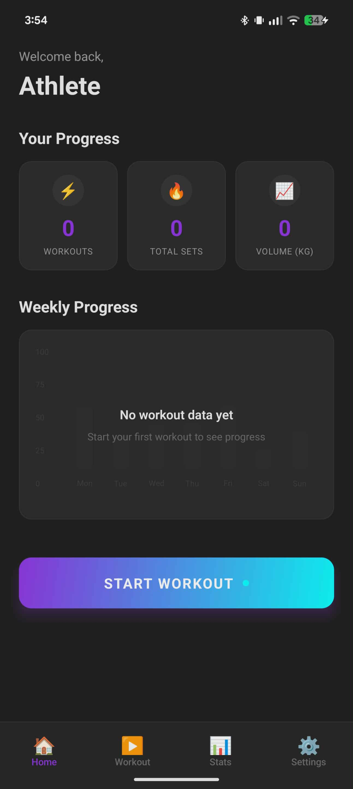

<div align="center">

# Halterofit

**Science-based fitness tracking with intelligent analytics**

[](https://expo.dev)
[](https://react.dev)
[](https://reactnative.dev)
[](https://typescriptlang.org)
[](https://nativewind.dev)
[](https://supabase.com)
[](https://github.com)
[](https://github.com/Kamaiko/HalteroFit/actions/workflows/ci.yml)

<br/>



_⚠️ Placeholder UI_

</div>

---

## 🚀 Quick Start

```bash
# 1. Clone and install
git clone https://github.com/Kamaiko/HalteroFit.git
cd HalteroFit
npm install

# 2. Configure environment & build (first time setup)
# See CONTRIBUTING.md for complete setup guide (~15-20 min)
```

**⚠️ Note:** This project requires **Development Build** (not Expo Go) due to native modules (WatermelonDB, MMKV).

---

## 📚 Documentation

**Choose the right document for your need:**

| Document                                             | When to Read                 | Purpose                                     |
| ---------------------------------------------------- | ---------------------------- | ------------------------------------------- |
| **[CONTRIBUTING.md](docs/CONTRIBUTING.md)** ⭐       | Setup & daily development    | Complete setup guide, workflow, commands    |
| **[TASKS.md](docs/TASKS.md)** 📋                     | Planning next tasks          | Roadmap (97 tasks across 6 phases)          |
| **[DATABASE.md](docs/DATABASE.md)** 💾               | Working with data/database   | WatermelonDB setup, schema, CRUD operations |
| **[ARCHITECTURE.md](docs/ARCHITECTURE.md)** 🏗️       | Understanding code structure | Folder organization, patterns, imports      |
| **[TECHNICAL.md](docs/TECHNICAL.md)** 🎓             | Understanding tech decisions | Architecture Decision Records (ADRs)        |
| **[TROUBLESHOOTING.md](docs/TROUBLESHOOTING.md)** 🆘 | When something breaks        | Common issues & solutions                   |
| **[PRD.md](docs/PRD.md)** 📄                         | Understanding product vision | Requirements, user stories, success metrics |

**Quick Navigation:**

- 🎯 **Current Phase:** 0.5.B - Development Build Migration (8/10 complete) → [TASKS.md § Phase 0.5.B](docs/TASKS.md#05b-development-build-migration-810--in-progress)
- 🚀 **Next Steps:** See [CONTRIBUTING.md § Daily Development](docs/CONTRIBUTING.md#️-development-workflow) for workflow

---

## 🎯 What Makes Halterofit Different

**Context-aware analytics that understand YOUR training:**

- 📊 **Personalized 1RM** adjusted by RIR (proximity to failure matters)
- 📈 **Load management** (Acute/Chronic ratios, fatigue tracking, overtraining alerts)
- 🎯 **Nutrition phase tracking** (bulk/cut/maintenance - stable in cut = success, not plateau)
- 🧪 **Science-based plateau detection** (Mann-Kendall statistical test + context)
- 📝 **Post-workout reports** (performance score, fatigue estimate, actionable recommendations)
- 📅 **Weekly summaries** (trends, PRs, consistency, deload suggestions)

**Unlike Jefit/Strong/Hevy:** We don't just show numbers - we explain WHY and WHAT TO DO.

---

## 🛠️ Tech Stack

| Layer         | Category     | Technologies                                                    |
| ------------- | ------------ | --------------------------------------------------------------- |
| **Frontend**  | Framework    | Expo SDK 54.0.21 + React Native 0.81.5 + TypeScript 5.9         |
|               | Navigation   | Expo Router 6                                                   |
|               | Styling      | NativeWind v4 (Tailwind CSS 3.4)                                |
|               | State        | Zustand 5.0 + React Query 5.90                                  |
|               | **Database** | **WatermelonDB 0.28.0** ✅ (offline-first, reactive) + Supabase |
|               | Storage      | **MMKV v4.x** ✅ (10-30x faster, Nitro Modules, encrypted)      |
|               | Charts       | **Victory Native** ✅ (Skia rendering, professional)            |
|               | UI           | FlashList + expo-image                                          |
| **Backend**   | Platform     | Supabase (PostgreSQL + Auth + Storage + Real-time)              |
| **External**  | Services     | ExerciseDB API (1,300+ exercises), Sentry, RevenueCat           |
| **Analytics** | Libraries    | simple-statistics (Mann-Kendall, regressions)                   |
| **Testing**   | Framework    | Jest + React Native Testing Library                             |
| **Build**     | Tool         | EAS Build (Development Build required)                          |

---

## 🎯 Current Status

**Version:** 0.1.0 | **Progress:** 13/97 tasks (13%) | **Phase:** 0.5.B - Development Build Migration (8/10)

---

## 🚀 Key Architecture Decisions

**Why Development Build from Day 1?**

We're building with production-grade tools from the start to avoid costly refactoring later:

| Choice             | Why                                                      | Alternative            |
| ------------------ | -------------------------------------------------------- | ---------------------- |
| **WatermelonDB**   | Offline-first + Reactive queries + Built-in sync         | expo-sqlite            |
| **MMKV**           | 10-30x faster + Native encryption                        | AsyncStorage           |
| **Victory Native** | Professional charts + Skia rendering + Advanced gestures | react-native-chart-kit |

---
